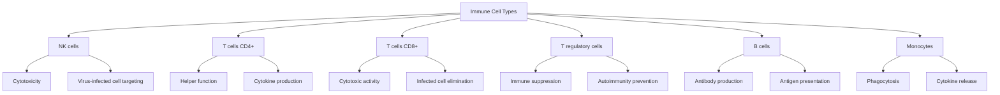
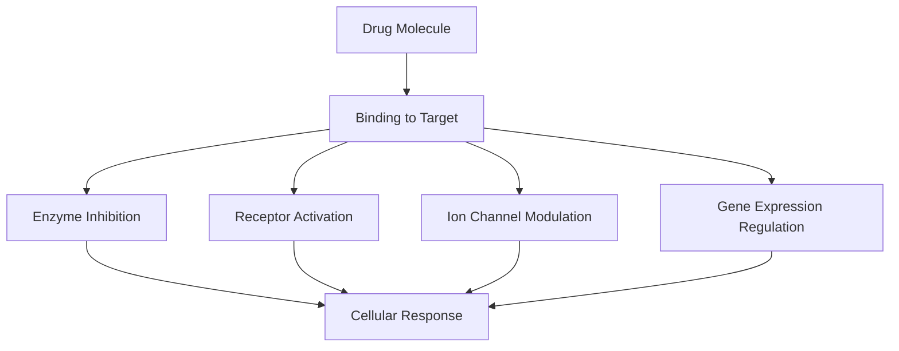
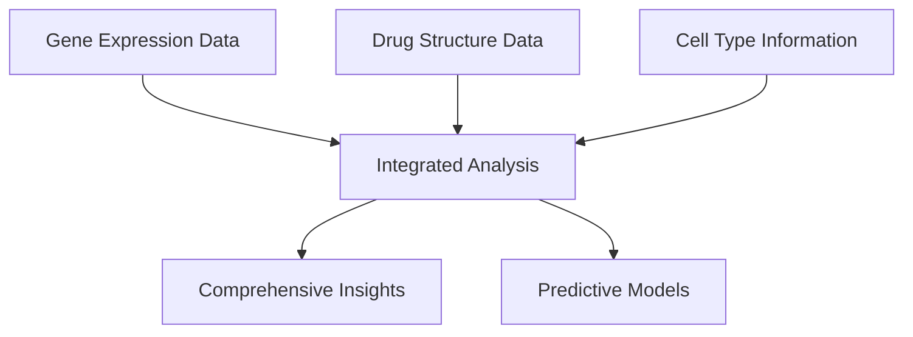
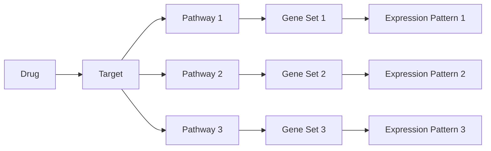

# Biological Concepts in Single-Cell Perturbation Analysis

This document provides a detailed overview of the biological concepts involved in our single-cell perturbation analysis project.

## Cell Biology Fundamentals

### Cell Types and Their Functions



### Cellular Components Relevant to Drug Response

```
┌───────────────────────────────────────┐
│             Cell Membrane             │
│  ┌─────────────────────────────────┐  │
│  │         Cytoplasm               │  │
│  │                                 │  │
│  │  ┌─────────────────────┐        │  │
│  │  │      Nucleus        │        │  │
│  │  │                     │        │  │
│  │  │  ┌─────────────┐    │        │  │
│  │  │  │    DNA      │    │        │  │
│  │  │  │  (Genes)    │    │        │  │
│  │  │  └─────────────┘    │        │  │
│  │  │                     │        │  │
│  │  └─────────────────────┘        │  │
│  │                                 │  │
│  │  ┌─────────────┐ ┌───────────┐  │  │
│  │  │ Mitochondria│ │ Ribosomes │  │  │
│  │  └─────────────┘ └───────────┘  │  │
│  │                                 │  │
│  │  ┌─────────────┐ ┌───────────┐  │  │
│  │  │   ER/Golgi  │ │ Receptors │  │  │
│  │  └─────────────┘ └───────────┘  │  │
│  └─────────────────────────────────┘  │
└───────────────────────────────────────┘
```

## Gene Expression and Regulation

### Transcription and Translation Process

```
DNA → RNA → Protein
```

In more detail:

```
┌──────────────────────────────────────┐
│             Nucleus                  │
│                                      │
│  DNA                                 │
│  ↓ Transcription                     │
│  mRNA                                │
│                                      │
└──────────┬───────────────────────────┘
           │
           ↓
┌──────────────────────────────────────┐
│             Cytoplasm                │
│                                      │
│  mRNA                                │
│  ↓ Translation                       │
│  Protein                             │
│                                      │
└──────────────────────────────────────┘
```

### Gene Expression Measurement

Our project captures gene expression levels across 18,211 genes in the dataset. This data is represented as a matrix:

```
                  Genes (18,211)
         ┌───┬───┬───┬───┬───┬─...─┐
         │G₁ │G₂ │G₃ │G₄ │G₅ │...  │
┌────────┼───┼───┼───┼───┼───┼─...─┤
│Sample₁ │0.1│2.3│-0.5│1.2│0.0│...  │
├────────┼───┼───┼───┼───┼───┼─...─┤
│Sample₂ │1.5│0.3│0.7│-1.0│2.1│...  │
├────────┼───┼───┼───┼───┼───┼─...─┤
│Sample₃ │-0.2│1.1│0.5│0.8│-0.3│... │
├────────┼───┼───┼───┼───┼───┼─...─┤
│  ...   │...│...│...│...│...│...  │
└────────┴───┴───┴───┴───┴───┴─...─┘
```

## Perturbation Biology

### Mechanism of Drug Perturbations


### Common Cellular Perturbation Effects

```
┌───────────────────┐     ┌───────────────────┐
│ Unperturbed Cell  │     │  Perturbed Cell   │
│                   │     │                   │
│  Normal pathways  │     │ Altered pathways  │
│  Baseline gene    │ --> │ Modified gene     │
│  expression       │     │ expression        │
│  Regular function │     │ Changed function  │
│                   │     │                   │
└───────────────────┘     └───────────────────┘
```

## Molecular Structure of Drugs

### SMILES Notation

SMILES (Simplified Molecular Input Line Entry System) is a notation system used to represent chemical structures. Example:

```
Clotrimazole: Clc1ccccc1C(c1ccccc1)(c1ccccc1)n1ccnc1
```

Visual representation of molecular structure:

```
      Cl
       |
     /   \
    |     |
    |     |
     \   /
       C       N
      / \     / \
     /   \   |   |
    |     | /     \
    |     C        N
     \   / \     /
       C   C---C
      / \ 
     /   \
    |     |
    |     |
     \   /
       C
```

### Drug-Target Interactions



## Biological Visualization Methods

### Gene Expression Heatmaps

Our project uses heatmaps to visualize gene expression patterns across samples:

```
            Samples
     ┌───┬───┬───┬───┬───┬───┐
     │S₁ │S₂ │S₃ │S₄ │S₅ │S₆ │
┌────┼───┼───┼───┼───┼───┼───┤
│Gene₁│🟥 │🟧 │🟨 │🟨 │🟩 │🟦 │
├────┼───┼───┼───┼───┼───┼───┤
│Gene₂│🟦 │🟦 │🟩 │🟨 │🟥 │🟥 │
├────┼───┼───┼───┼───┼───┼───┤
│Gene₃│🟩 │🟩 │🟩 │🟧 │🟧 │🟥 │
├────┼───┼───┼───┼───┼───┼───┤
│Gene₄│🟥 │🟧 │🟨 │🟩 │🟦 │🟦 │
└────┴───┴───┴───┴───┴───┴───┘
  High 🟥 🟧 🟨 🟩 🟦 Low expression
```

### Principal Component Analysis (PCA)

PCA is used to reduce the dimensionality of gene expression data and visualize relationships:

```
       PC2
        ↑
        │       Cell Type T-reg
        │         ●  ●
        │           ●
        │     ●
        │  ● ●   ●
────────┼──────────────→ PC1
        │      ●
        │    ● ● ●    Cell Type NK
        │     ●  ●
        │       ●
        │      ●
        │
```

### t-SNE/UMAP Visualizations

Non-linear dimensionality reduction techniques help visualize complex relationships in the data:

```
          ╭───────╮
         ╱         ╲
        ╱  Cluster 1 ╲
       (  ● ● ●       )
        ╲    ● ●     ╱
         ╰─────────╯
                        ╭───────╮
                       ╱         ╲
                      ╱ Cluster 2  ╲
      ╭───────╮     (    ●  ●      )
     ╱         ╲     ╲  ●  ●      ╱
    ╱ Cluster 3  ╲    ╰──────────╯
   (  ●  ●  ●     )
    ╲  ●  ●      ╱     ╭───────╮
     ╰──────────╯     ╱         ╲
                     ╱ Cluster 4  ╲
                    (    ●  ●      )
                     ╲   ●        ╱
                      ╰──────────╯
```

## Data Integration Approach

### Multi-omics Integration



### Biological Pathway Analysis

