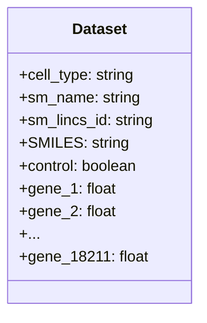
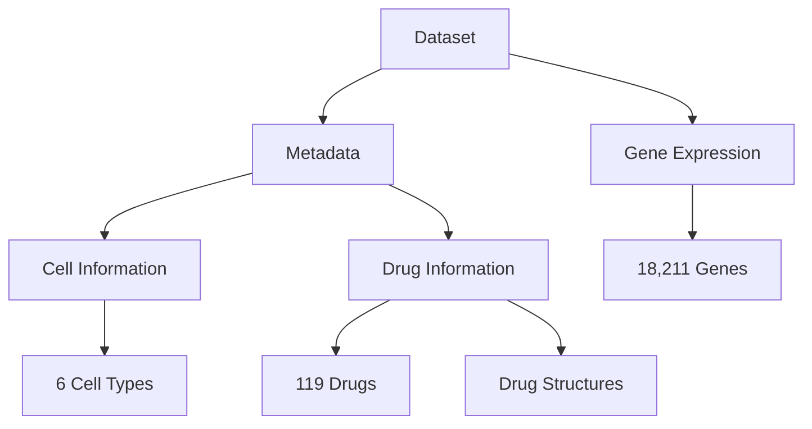
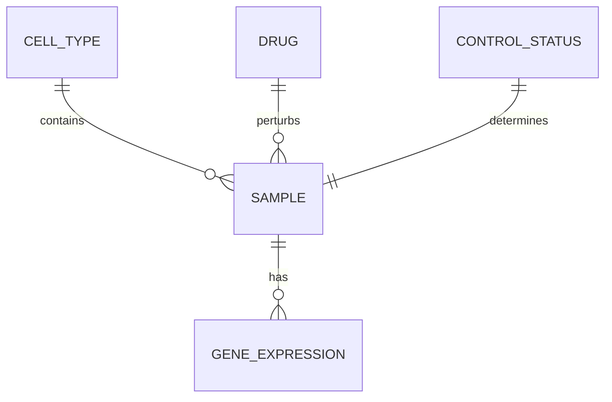
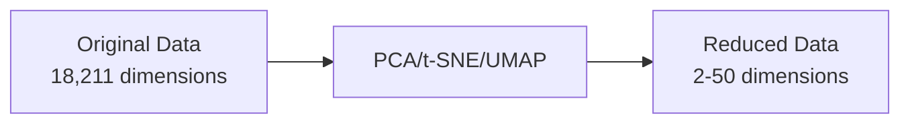
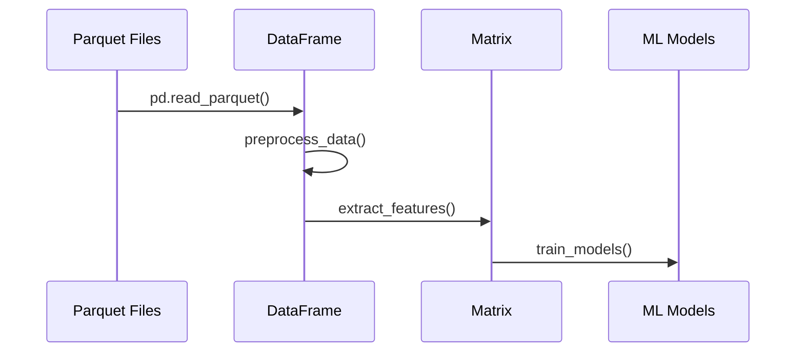

# Data Structure Architecture

This document provides a detailed description of the data structures used throughout the Single-Cell Perturbations Analysis project.

## Primary Data Storage Format

Our project uses the Apache Parquet format for storing single-cell perturbation data. Parquet offers several advantages:

- Column-oriented storage (ideal for our gene expression data)
- Efficient compression
- Fast querying capabilities
- Compatibility with big data frameworks

```
┌───────────────────┐
│ Parquet File      │
│ ┌───────────────┐ │
│ │ Row Group 1   │ │
│ │ ┌───────────┐ │ │
│ │ │ Column 1  │ │ │
│ │ │ Column 2  │ │ │
│ │ │   ...     │ │ │
│ │ │ Column N  │ │ │
│ │ └───────────┘ │ │
│ └───────────────┘ │
│ ┌───────────────┐ │
│ │ Row Group 2   │ │
│ │     ...       │ │
│ └───────────────┘ │
│        ...        │
└───────────────────┘
```

## Dataset Schema

The dataset contains 501 training samples and 113 test samples with the following schema:



### Metadata Columns

```
┌──────────────┬─────────────────┬───────────────────────────┐
│ Column Name  │ Data Type       │ Description               │
├──────────────┼─────────────────┼───────────────────────────┤
│ cell_type    │ string          │ Type of immune cell       │
│ sm_name      │ string          │ Drug name                 │
│ sm_lincs_id  │ string          │ Drug identifier           │
│ SMILES       │ string          │ Molecular structure       │
│ control      │ boolean         │ Control or treatment      │
└──────────────┴─────────────────┴───────────────────────────┘
```

### Gene Expression Data

The remaining columns (18,211 in total) represent individual genes with their expression values. Each value represents the normalized expression level:

```
┌────────────┬─────────────┬───────────────────────────────────┐
│ Column Name│ Data Type   │ Description                       │
├────────────┼─────────────┼───────────────────────────────────┤
│ A1BG       │ float       │ Alpha-1-B glycoprotein expression │
│ A1BG-AS1   │ float       │ A1BG antisense RNA 1 expression   │
│ A2M        │ float       │ Alpha-2-macroglobulin expression  │
│ ...        │ ...         │ ...                               │
│ ZZEF1      │ float       │ Zinc finger ZZ-type expression    │
└────────────┴─────────────┴───────────────────────────────────┘
```

## Data Organization

### Logical Organization



### Physical Organization

```
project/
├── dataset/
│   ├── de_train_split.parquet (501 samples)
│   └── de_test_split.parquet (113 samples)
├── models/
│   ├── cell_type_classifier.pkl
│   └── drug_response_model.pkl
└── results/
    └── gene_expression_predictions.csv
```

## Data Dimensions

The dataset has high dimensionality, primarily due to the large number of genes:

```
┌─────────────────┬────────┐
│ Dimension       │ Count  │
├─────────────────┼────────┤
│ Samples         │ 501    │
│ Features (Genes)│ 18,211 │
│ Cell Types      │ 6      │
│ Drugs           │ 119    │
│ Control Samples │ 12     │
└─────────────────┴────────┘
```

This can be visualized as a 3D tensor:

```
    ┌─────────┐
   /│         /│
  / │        / │
 /  │       /  │
┌───┼──────┐   │
│   │      │   │  ↑
│   │      │   │ Genes
│   │      │   │  ↓
│   └──────┼───┘
│  /       │  /
│ /        │ /
│/         │/
└──────────┘
←  Samples  →
   ↙ Cell Types/Drugs ↘
```

## Data Relationships

### Entity Relationships



### Hierarchical Structure

```
Drug Response Data
├── Cell Type 1 (NK cells)
│   ├── Drug 1
│   │   └── Gene Expression Profile
│   ├── Drug 2
│   │   └── Gene Expression Profile
│   └── ...
├── Cell Type 2 (T cells CD4+)
│   ├── Drug 1
│   │   └── Gene Expression Profile
│   └── ...
└── ...
```

## Processed Data Formats

### Feature Matrices

For machine learning, we extract feature matrices:

```
X (Features)                Y (Target)
┌───────────┬───────────┐   ┌───────────┐
│ cell_type │ drug_name │   │ gene_1    │
├───────────┼───────────┤   ├───────────┤
│ NK cells  │ Drug A    │   │ 0.24      │
├───────────┼───────────┤   ├───────────┤
│ T cells   │ Drug B    │   │ -1.05     │
├───────────┼───────────┤   ├───────────┤
│ ...       │ ...       │   │ ...       │
└───────────┴───────────┘   └───────────┘
```

### Molecular Descriptors

For drug analysis, we extract molecular descriptors:

```
┌──────────┬───────────┬───────┬──────┬──────────────┐
│ Drug     │ Mol Weight│ LogP  │ TPSA │ HB Acceptors │
├──────────┼───────────┼───────┼──────┼──────────────┤
│ Drug A   │ 324.5     │ 2.4   │ 62.3 │ 4            │
├──────────┼───────────┼───────┼──────┼──────────────┤
│ Drug B   │ 412.8     │ 3.8   │ 85.1 │ 6            │
├──────────┼───────────┼───────┼──────┼──────────────┤
│ ...      │ ...       │ ...   │ ...  │ ...          │
└──────────┴───────────┴───────┴──────┴──────────────┘
```

## Data Transformations

### Normalization and Scaling

```
Original Data          Scaled Data
┌─────┬─────┬─────┐   ┌─────┬─────┬─────┐
│  10 │ 100 │ 1000│   │ -1.0│  0.0│  1.0│
├─────┼─────┼─────┤   ├─────┼─────┼─────┤
│  20 │ 200 │ 2000│   │ -0.9│  0.1│  1.1│
├─────┼─────┼─────┤   ├─────┼─────┼─────┤
│ ... │ ... │ ... │   │ ... │ ... │ ... │
└─────┴─────┴─────┘   └─────┴─────┴─────┘
```

### Dimensionality Reduction



## Data Loading Process



## Data Flow in the Pipeline

```
┌─────────────┐    ┌─────────────┐    ┌─────────────┐
│ Input       │    │ Processing  │    │ Analysis    │
│ ─────────── │    │ ─────────── │    │ ─────────── │
│ Parquet     │───>│ Pandas      │───>│ Statistical │
│ Files       │    │ DataFrame   │    │ Analysis    │
└─────────────┘    └─────────────┘    └─────────────┘
                                             │
       ┌─────────────────────────────────────┘
       │
       ▼
┌─────────────┐    ┌─────────────┐    ┌─────────────┐
│ ML          │    │ Predictions │    │ Evaluation  │
│ ─────────── │    │ ─────────── │    │ ─────────── │
│ Model       │───>│ Gene        │───>│ Metrics &   │
│ Training    │    │ Expression  │    │ Validation  │
└─────────────┘    └─────────────┘    └─────────────┘
``` 