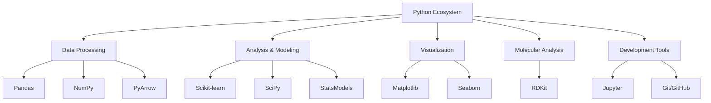
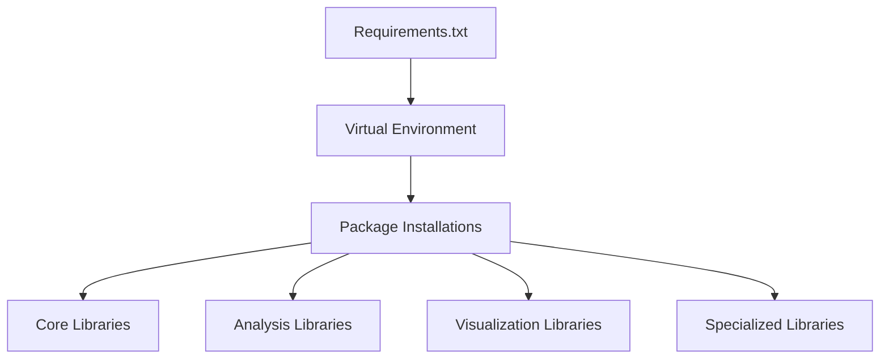
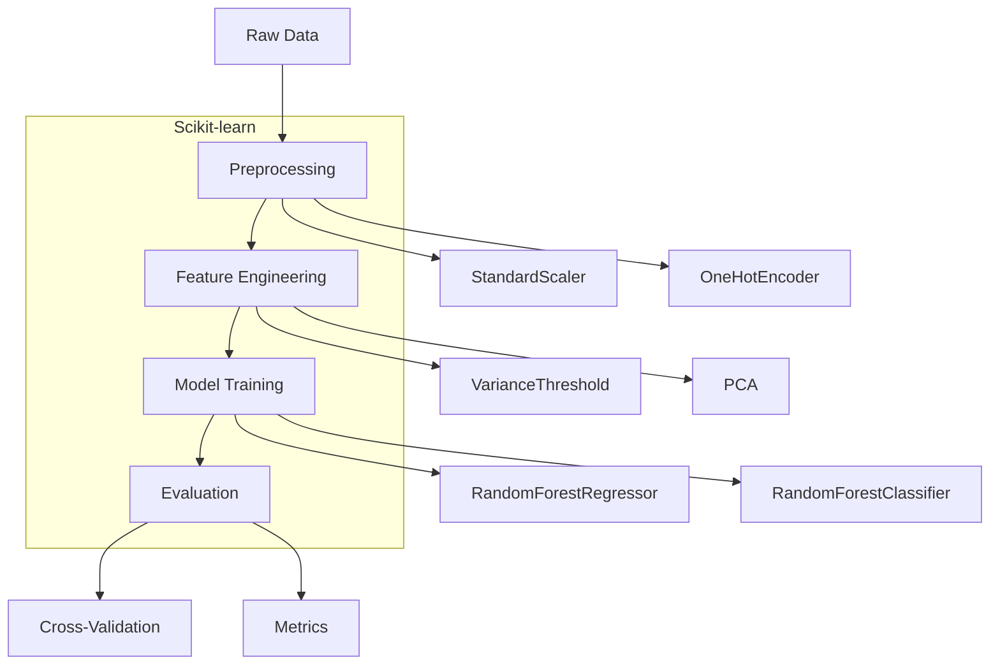
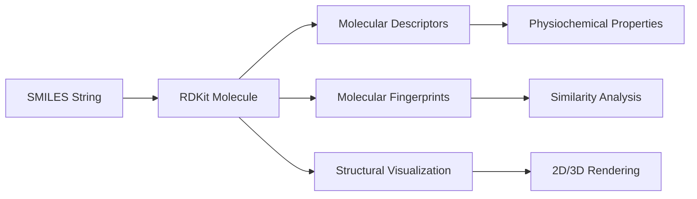
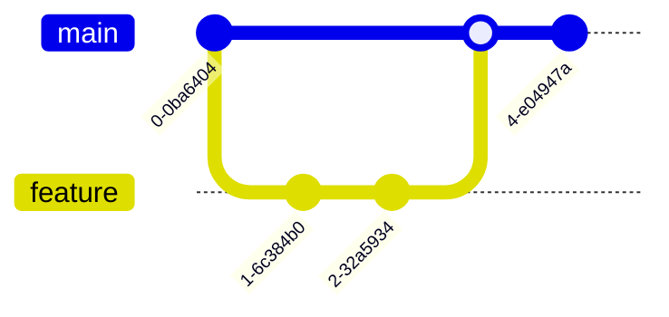
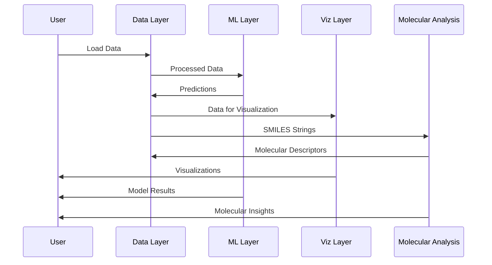

# Technical Stack Architecture

This document details the technical stack used in the Single-Cell Perturbations Analysis project, including core libraries, frameworks, and tools.

## Technology Stack Overview



## Core Technologies

### Python Ecosystem

Python serves as the foundation of our technical stack due to its rich ecosystem for data science and bioinformatics:

```
┌─────────────────────────────────────────────────────────┐
│                     Python 3.7+                         │
├─────────────────────────────────────────────────────────┤
│ ┌─────────────┐ ┌─────────────┐ ┌─────────────────────┐ │
│ │ Data        │ │ Scientific  │ │ Machine Learning    │ │
│ │ Manipulation│ │ Computing   │ │ & Statistics        │ │
│ └─────────────┘ └─────────────┘ └─────────────────────┘ │
└─────────────────────────────────────────────────────────┘
```

### Dependency Management



## Data Processing Layer

### Pandas & NumPy

```
┌───────────────────────────────────────────┐
│               Pandas                      │
│  ┌────────────────────────────────────┐   │
│  │           DataFrame                │   │
│  │  ┌──────┬──────┬──────┬───────┐    │   │
│  │  │Index │Col 1 │Col 2 │ ...   │    │   │
│  │  ├──────┼──────┼──────┼───────┤    │   │
│  │  │  0   │ val  │ val  │ ...   │    │   │
│  │  ├──────┼──────┼──────┼───────┤    │   │
│  │  │  1   │ val  │ val  │ ...   │    │   │
│  │  └──────┴──────┴──────┴───────┘    │   │
│  └────────────────────────────────────┘   │
│                   ▲                       │
│                   │                       │
│  ┌────────────────────────────────────┐   │
│  │             NumPy                  │   │
│  │  ┌──────────────────────────────┐  │   │
│  │  │         ndarray              │  │   │
│  │  └──────────────────────────────┘  │   │
│  └────────────────────────────────────┘   │
└───────────────────────────────────────────┘
```

Key capabilities:
- **Pandas**: Data manipulation, cleaning, and analysis
- **NumPy**: Numerical computing and array operations
- **PyArrow**: Efficient Parquet file handling

## Analysis and Modeling Layer

### Machine Learning with Scikit-learn



### Statistical Analysis with SciPy and StatsModels

These libraries provide statistical functions for hypothesis testing, feature selection, and more:

```
┌───────────────────────────────────────────────┐
│                SciPy & StatsModels            │
├───────────────────────────────────────────────┤
│ ┌─────────────────┐ ┌───────────────────────┐ │
│ │ Hypothesis Tests│ │ Statistical Models    │ │
│ │ - t-test        │ │ - Linear Regression   │ │
│ │ - ANOVA         │ │ - Logistic Regression │ │
│ │ - Chi-square    │ │ - Time Series         │ │
│ └─────────────────┘ └───────────────────────┘ │
│ ┌─────────────────┐ ┌───────────────────────┐ │
│ │ Multiple Testing│ │ Descriptive Statistics│ │
│ │ - FDR Correction│ │ - Summary Statistics  │ │
│ │ - Bonferroni    │ │ - Distribution Tests  │ │
│ └─────────────────┘ └───────────────────────┘ │
└───────────────────────────────────────────────┘
```

## Visualization Layer

### Data Visualization with Matplotlib and Seaborn

Visualization capabilities are critical for interpreting the complex data in our project:

```python
# Sample Visualization Code
import matplotlib.pyplot as plt
import seaborn as sns

# Create plot
plt.figure(figsize=(10, 6))
sns.scatterplot(x='PC1', y='PC2', hue='cell_type', data=pca_results)
plt.title('PCA of Gene Expression by Cell Type')
plt.savefig('pca_visualization.png')
```

Visualization hierarchy:

```
┌───────────────────────────────────────────────┐
│               Visualization Layer             │
│                                               │
│  ┌─────────────────────┐  ┌────────────────┐  │
│  │    Matplotlib       │  │    Seaborn     │  │
│  │  (Low-level API)    │  │(High-level API)│  │
│  └─────────────────────┘  └────────────────┘  │
│  ┌────────────────────────────────────────┐   │
│  │           Output Formats               │   │
│  │    PNG    │    PDF    │    SVG         │   │
│  └────────────────────────────────────────┘   │
└───────────────────────────────────────────────┘
```

### Common Plot Types

```
┌───────────────┐ ┌───────────────┐ ┌───────────────┐
│  Heatmap      │ │  PCA/t-SNE    │ │  Bar Charts   │
│               │ │               │ │               │
│  █████████    │ │      •        │ │   █    █      │
│  █████████    │ │    • • •      │ │   █    █      │
│  █████████    │ │   •  •    •   │ │   █  █ █ █    │
│               │ │  •   •     •  │ │   █  █ █ █    │
└───────────────┘ └───────────────┘ └───────────────┘

┌───────────────┐ ┌───────────────┐ ┌───────────────┐
│  Boxplots     │ │ Volcano Plots │ │ Molecule Viz  │
│               │ │               │ │               │
│    ┬─┐        │ │      •        │ │    O═C−N      │
│    │ │        │ │    •   •      │ │    /   \      │
│    ├─┤        │ │  •       •    │ │  •     •      │
│    └─┘        │ │ •  •  •  •  • │ │    \   /      │
│               │ │               │ │     C═C       │
└───────────────┘ └───────────────┘ └───────────────┘
```

## Molecular Analysis Layer

### Cheminformatics with RDKit

RDKit is used for analyzing drug structures from SMILES strings:



Key RDKit capabilities:
- SMILES parsing and manipulation
- Molecular descriptor calculation
- Chemical structure visualization
- Similarity searching
- Molecular fingerprinting

## Development and Collaboration Tools

### Interactive Development with Jupyter

```
┌───────────────────────────────────────────────┐
│               Jupyter Notebook                │
├───────────────────────────────────────────────┤
│ ┌─────────────────────────────────────────┐   │
│ │ # Markdown Cell                         │   │
│ │ This is explanatory text                │   │
│ └─────────────────────────────────────────┘   │
│ ┌─────────────────────────────────────────┐   │
│ │ # Code Cell                             │   │
│ │ import pandas as pd                     │   │
│ │ df = pd.read_parquet('data.parquet')    │   │
│ │ df.head()                               │   │
│ └─────────────────────────────────────────┘   │
│ ┌─────────────────────────────────────────┐   │
│ │ # Output Cell                           │   │
│ │ [Table output from above command]       │   │
│ └─────────────────────────────────────────┘   │
└───────────────────────────────────────────────┘
```

### Version Control with Git and GitHub



## System Integration

### Component Interaction



### Architecture Layers

```
┌───────────────────────────────────────────────┐
│             Application Layer                 │
│  ┌────────────────────────────────────────┐   │
│  │   Notebooks │ Scripts │ Models │ Data  │   │
│  └────────────────────────────────────────┘   │
└───────────────────────────────────────────────┘
                     ▲
                     │
┌───────────────────────────────────────────────┐
│              Framework Layer                  │
│  ┌──────────┐ ┌─────────┐ ┌───────────────┐   │
│  │ Pandas   │ │ Sklearn │ │ Matplotlib    │   │
│  │ NumPy    │ │ SciPy   │ │ Seaborn       │   │
│  │ PyArrow  │ │ RDKit   │ │ IPython       │   │
│  └──────────┘ └─────────┘ └───────────────┘   │
└───────────────────────────────────────────────┘
                     ▲
                     │
┌───────────────────────────────────────────────┐
│              Python Runtime                   │
│  ┌────────────────────────────────────────┐   │
│  │       Python 3.7+ Interpreter          │   │
│  └────────────────────────────────────────┘   │
└───────────────────────────────────────────────┘
                     ▲
                     │
┌───────────────────────────────────────────────┐
│               Operating System                │
└───────────────────────────────────────────────┘
```

## Performance Considerations

### Memory Management

For handling the large gene expression dataset:

```python
# Efficient loading with column selection
specific_genes = ['gene1', 'gene2', '...']
df = pd.read_parquet('data.parquet', columns=specific_genes)

# Chunking for large operations
chunk_size = 100
for chunk in pd.read_parquet('data.parquet', chunksize=chunk_size):
    # Process each chunk
    process_chunk(chunk)
```

### Computation Optimization

```python
# Parallel processing for model training
from sklearn.ensemble import RandomForestClassifier

# Use all available cores
model = RandomForestClassifier(n_jobs=-1)
model.fit(X_train, y_train)
```

## Deployment and Execution

### Running Scripts and Notebooks

```bash
# Running analysis scripts
python analyze_data.py

# Running model training
python train_model.py

# Making predictions
python predict.py --test
```

### Environment Reproducibility

```bash
# Creating a virtual environment
python -m venv venv

# Installing dependencies
pip install -r requirements.txt
``` 