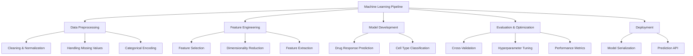
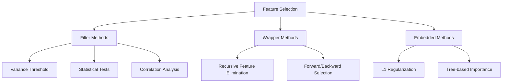
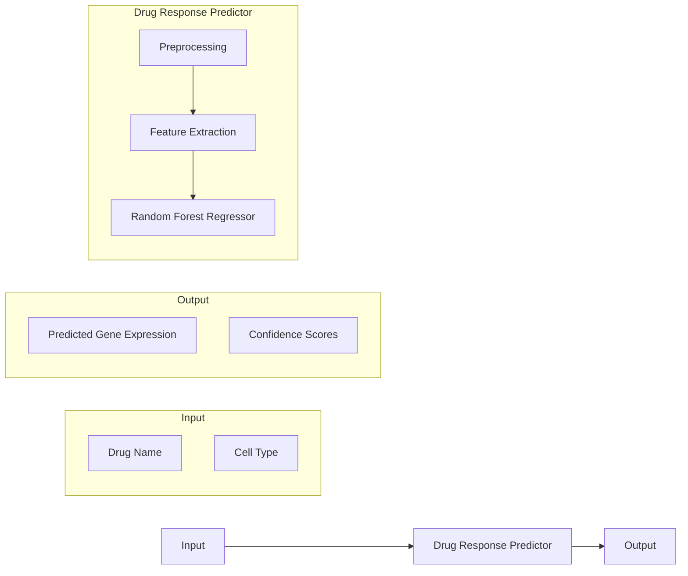
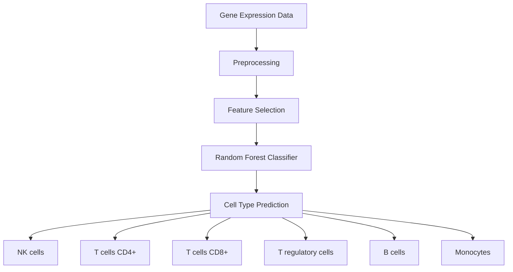
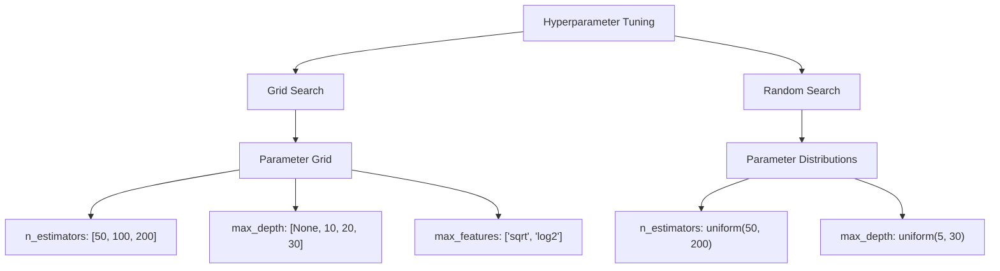
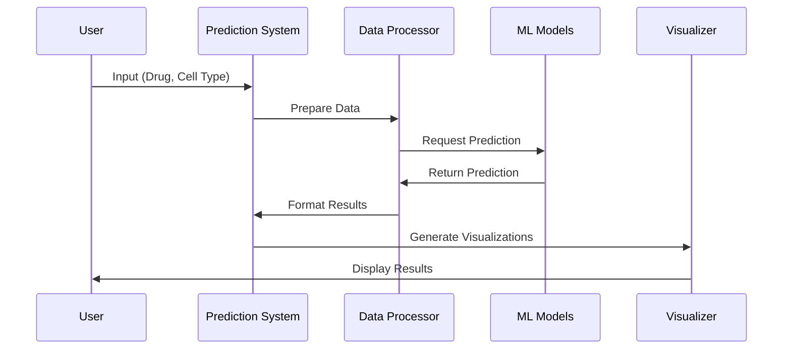
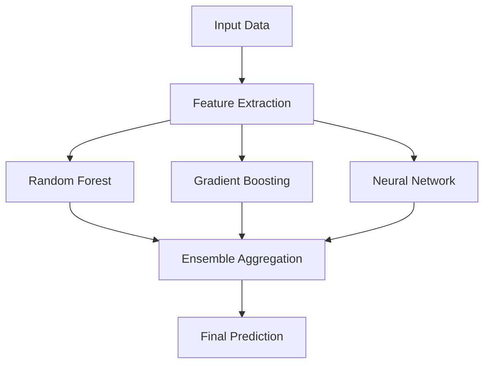
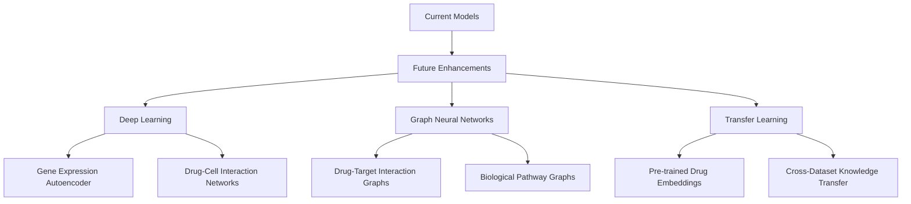
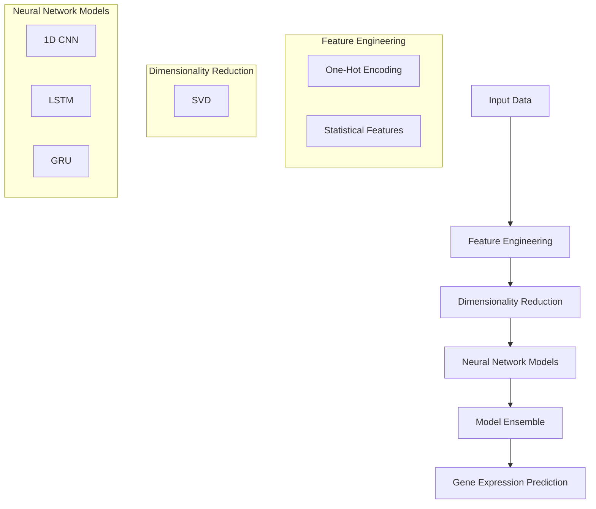

# Machine Learning Approach

This document details the machine learning approaches used in the Single-Cell Perturbations Analysis project for predicting drug responses and classifying cell types.

## Machine Learning Overview



## Data Preprocessing Techniques

### Standardization and Normalization

Gene expression data requires normalization to make meaningful comparisons across samples:

```
┌───────────────────────────────────────────────┐
│          Standardization (Z-score)            │
│                                               │
│           x - μ                               │
│  z = ─────────────                            │
│            σ                                  │
│                                               │
│  Where:                                       │
│  z = standardized value                       │
│  x = original value                           │
│  μ = mean of the feature                      │
│  σ = standard deviation of the feature        │
└───────────────────────────────────────────────┘
```

Example of transformation:

```
Before                        After
┌────┬────┬────┬────┐        ┌────┬────┬────┬────┐
│Gene│Sam1│Sam2│Sam3│        │Gene│Sam1│Sam2│Sam3│
├────┼────┼────┼────┤        ├────┼────┼────┼────┤
│ A  │ 50 │ 100│ 200│   →    │ A  │-1.0│ 0.0│ 1.0│
├────┼────┼────┼────┤        ├────┼────┼────┼────┤
│ B  │ 25 │ 50 │ 75 │   →    │ B  │-1.0│ 0.0│ 1.0│
└────┴────┴────┴────┘        └────┴────┴────┴────┘
```

### Categorical Feature Encoding

Encoding cell types and drug names for machine learning:

```python
from sklearn.preprocessing import OneHotEncoder

# Example code
categorical_encoder = OneHotEncoder(handle_unknown='ignore')
categorical_features = categorical_encoder.fit_transform([
    ['NK cells', 'Clotrimazole'],
    ['T cells CD4+', 'Triptolide']
])
```

Result:

```
┌──────────────┬────────────┬───────────┬─────────┬──────────┐
│              │ NK cells   │T cells CD4│Clotrim. │Triptolide│
├──────────────┼────────────┼───────────┼─────────┼──────────┤
│Sample 1      │     1      │     0     │    1    │     0    │
├──────────────┼────────────┼───────────┼─────────┼──────────┤
│Sample 2      │     0      │     1     │    0    │     1    │
└──────────────┴────────────┴───────────┴─────────┴──────────┘
```

## Feature Engineering

### Feature Selection Methods



In our project, we primarily use:

1. **Variance Threshold**: Removing genes with low variance
2. **Feature Importance**: Using Random Forest feature importance
3. **Domain Knowledge**: Selecting genes known to be affected by drugs

### Dimensionality Reduction

```python
# PCA Implementation
from sklearn.decomposition import PCA

pca = PCA(n_components=50)
pca_result = pca.fit_transform(gene_expression_data)

# Explained variance
explained_variance = pca.explained_variance_ratio_
cumulative_variance = np.cumsum(explained_variance)
```

Visualization of dimensionality reduction:

```
                            High-Dimensional Space
                            (18,211 genes)
                                   │
                                   ▼
┌───────────────────────────────────────────────────────┐
│                                                       │
│                 Dimensionality Reduction              │
│                                                       │
│  ┌───────────────┐    ┌───────────────┐              │
│  │      PCA      │    │    t-SNE      │              │
│  │  Linear       │    │  Non-linear   │              │
│  │  Projection   │    │  Projection   │              │
│  └───────────────┘    └───────────────┘              │
│                                                       │
└───────────────────────────────────────────────────────┘
                                   │
                                   ▼
                            Low-Dimensional Space
                            (2-50 dimensions)
```

### Feature Matrix Construction

```
┌───────────────────────────────────────────────────────┐
│                 Feature Matrix                        │
├───────────────────────────────────────────────────────┤
│                                                       │
│  Rows = Samples (drugs + cell types)                  │
│  Columns = Features                                   │
│                                                       │
│  ┌───────────────────────────────────────────────┐    │
│  │ Sample │ Cell Type │ Drug │ Gene1 │ Gene2 │...│    │
│  ├───────────────────────────────────────────────┤    │
│  │   1    │ NK cells  │ DrugA│  0.5  │ -1.2  │...│    │
│  ├───────────────────────────────────────────────┤    │
│  │   2    │ T cells   │ DrugB│ -0.3  │  0.8  │...│    │
│  └───────────────────────────────────────────────┘    │
│                                                       │
└───────────────────────────────────────────────────────┘
```

## Model Development

### Drug Response Prediction



Model implementation:

```python
class DrugResponsePredictor:
    def __init__(self, n_estimators=100):
        self.n_estimators = n_estimators
        self.preprocessor = None
        self.model = None
    
    def fit(self, X, y):
        # Create preprocessing pipeline
        self.preprocessor = ColumnTransformer(
            transformers=[
                ('cat', OneHotEncoder(), ['cell_type', 'sm_name']),
                ('num', StandardScaler(), numerical_features)
            ]
        )
        
        # Preprocess data
        X_processed = self.preprocessor.fit_transform(X)
        
        # Train Random Forest model
        self.model = RandomForestRegressor(
            n_estimators=self.n_estimators,
            random_state=42
        )
        self.model.fit(X_processed, y)
        
    def predict(self, X):
        X_processed = self.preprocessor.transform(X)
        return self.model.predict(X_processed)
```

### Cell Type Classification



### Molecular Structure Integration

```python
# Integrating molecular features
from rdkit import Chem
from rdkit.Chem import Descriptors

def extract_molecular_features(smiles):
    mol = Chem.MolFromSmiles(smiles)
    features = {
        'MolWt': Descriptors.MolWt(mol),
        'LogP': Descriptors.MolLogP(mol),
        'NumHDonors': Descriptors.NumHDonors(mol),
        'NumHAcceptors': Descriptors.NumHAcceptors(mol),
        'NumRotatableBonds': Descriptors.NumRotatableBonds(mol)
    }
    return features
```

## Evaluation Methods

### Cross Validation Strategy

```
┌─────────────────────────────────────────────────────────┐
│           K-Fold Cross Validation (k=5)                 │
├─────────────────────────────────────────────────────────┤
│                                                         │
│  Fold 1  ┌─────┬─────┬─────┬─────┬─────┐                │
│          │ Test│Train│Train│Train│Train│                │
│          └─────┴─────┴─────┴─────┴─────┘                │
│                                                         │
│  Fold 2  ┌─────┬─────┬─────┬─────┬─────┐                │
│          │Train│ Test│Train│Train│Train│                │
│          └─────┴─────┴─────┴─────┴─────┘                │
│                                                         │
│  Fold 3  ┌─────┬─────┬─────┬─────┬─────┐                │
│          │Train│Train│ Test│Train│Train│                │
│          └─────┴─────┴─────┴─────┴─────┘                │
│                                                         │
│  Fold 4  ┌─────┬─────┬─────┬─────┬─────┐                │
│          │Train│Train│Train│ Test│Train│                │
│          └─────┴─────┴─────┴─────┴─────┘                │
│                                                         │
│  Fold 5  ┌─────┬─────┬─────┬─────┬─────┐                │
│          │Train│Train│Train│Train│ Test│                │
│          └─────┴─────┴─────┴─────┴─────┘                │
│                                                         │
└─────────────────────────────────────────────────────────┘
```

### Performance Metrics

```python
# Regression metrics for gene expression prediction
from sklearn.metrics import mean_squared_error, r2_score

# Calculate metrics
mse = mean_squared_error(y_true, y_pred)
r2 = r2_score(y_true, y_pred)

# Classification metrics for cell type
from sklearn.metrics import accuracy_score, classification_report

# Calculate metrics
accuracy = accuracy_score(y_true, y_pred)
report = classification_report(y_true, y_pred)
```

Visual representation of metrics:

```
┌───────────────────────────────────────────────────────┐
│                Regression Metrics                     │
├───────────────────────────────────────────────────────┤
│                                                       │
│  Mean Squared Error (MSE)                             │
│                                                       │
│  MSE = (1/n) Σ(y_true - y_pred)²                     │
│                                                       │
│  R² Score (Coefficient of Determination)              │
│                                                       │
│  R² = 1 - (Σ(y_true - y_pred)² / Σ(y_true - y_mean)²)│
│                                                       │
└───────────────────────────────────────────────────────┘

┌───────────────────────────────────────────────────────┐
│               Classification Metrics                  │
├───────────────────────────────────────────────────────┤
│                                                       │
│  Accuracy = Correct predictions / Total predictions   │
│                                                       │
│  Precision = True Positives / (True Positives +       │
│              False Positives)                         │
│                                                       │
│  Recall = True Positives / (True Positives +          │
│           False Negatives)                            │
│                                                       │
│  F1 Score = 2 * (Precision * Recall) /                │
│             (Precision + Recall)                      │
│                                                       │
└───────────────────────────────────────────────────────┘
```

### Hyperparameter Tuning



Implementation:

```python
# Grid search for hyperparameter tuning
from sklearn.model_selection import GridSearchCV

param_grid = {
    'n_estimators': [50, 100, 200],
    'max_depth': [None, 10, 20, 30],
    'max_features': ['sqrt', 'log2', None]
}

grid_search = GridSearchCV(
    RandomForestRegressor(random_state=42),
    param_grid=param_grid,
    cv=5,
    n_jobs=-1,
    verbose=1
)

grid_search.fit(X_train, y_train)
best_params = grid_search.best_params_
```

## Prediction and Visualization

### Prediction Pipeline



### Visualization of Model Results

```python
# Visualizing predictions vs actual values
def visualize_predictions(y_true, y_pred, gene_names, n_genes=5):
    import matplotlib.pyplot as plt
    import numpy as np
    
    # Select a subset of genes
    selected_genes = np.random.choice(gene_names, size=min(n_genes, len(gene_names)), replace=False)
    
    # Plot
    plt.figure(figsize=(15, 10))
    for i, gene in enumerate(selected_genes):
        plt.subplot(n_genes, 1, i+1)
        
        true_vals = y_true[gene]
        pred_vals = y_pred[gene]
        
        plt.scatter(true_vals, pred_vals, alpha=0.5)
        plt.plot([min(true_vals), max(true_vals)], [min(true_vals), max(true_vals)], 'r--')
        plt.title(f'Gene: {gene}')
        plt.xlabel('True Value')
        plt.ylabel('Predicted Value')
        
    plt.tight_layout()
    plt.show()
```

Example visualization:

```
┌────────────────────────────────────────────────────┐
│ Predicted vs Actual Gene Expression                │
├────────────────────────────────────────────────────┤
│                                                    │
│ Gene: IL6                                          │
│                  •                                 │
│               •    •                               │
│         •  •    •    •                             │
│       •      •          --- Perfect prediction     │
│     •    •                                         │
│                                                    │
├────────────────────────────────────────────────────┤
│ Gene: TNF                                          │
│                       •                            │
│             •    •  •   •                          │
│        •  •   •      •      •                      │
│      •   •                    --- Perfect prediction│
│                                                    │
├────────────────────────────────────────────────────┤
│ Gene: IFNG                                         │
│                                                    │
│            •   •                                   │
│       •  •  •     •  •                             │
│     •     •     •       •    --- Perfect prediction│
│                                                    │
└────────────────────────────────────────────────────┘
```

## Ensemble Methods

### Combination of Models



## Interpretation and Explainability

### Feature Importance

```python
# Extract and visualize feature importance
def plot_feature_importance(model, feature_names, top_n=20):
    import matplotlib.pyplot as plt
    import pandas as pd
    import seaborn as sns
    
    # Get feature importance
    importance = model.feature_importances_
    
    # Create dataframe
    feature_importance = pd.DataFrame({
        'Feature': feature_names,
        'Importance': importance
    }).sort_values('Importance', ascending=False)
    
    # Plot
    plt.figure(figsize=(10, 8))
    sns.barplot(x='Importance', y='Feature', data=feature_importance.head(top_n))
    plt.title(f'Top {top_n} Most Important Features')
    plt.tight_layout()
    plt.show()
    
    return feature_importance
```

Example visualization:

```
┌───────────────────────────────────────────────┐
│ Feature Importance                            │
├───────────────────────────────────────────────┤
│ cell_type_NK cells      ████████████          │
│ sm_name_Triptolide      █████████             │
│ cell_type_T cells CD4+  ████████              │
│ sm_name_Clotrimazole    ███████               │
│ cell_type_B cells       ██████                │
│ sm_name_Mitoxantrone    █████                 │
│ cell_type_Monocytes     ████                  │
│ ...                                           │
└───────────────────────────────────────────────┘
```

## Model Deployment

### Model Serialization

```python
# Save trained model
import pickle

with open('models/drug_response_model.pkl', 'wb') as f:
    pickle.dump(model, f)

# Load model for prediction
with open('models/drug_response_model.pkl', 'rb') as f:
    loaded_model = pickle.load(f)
```

### Prediction Script

```python
# Using the predict.py script
import argparse
import pandas as pd

def main():
    # Parse arguments
    parser = argparse.ArgumentParser(description='Predict drug responses')
    parser.add_argument('--drug', type=str, required=True, help='Drug name')
    parser.add_argument('--cell_type', type=str, required=True, help='Cell type')
    args = parser.parse_args()
    
    # Load model
    model = load_model('models/drug_response_model.pkl')
    
    # Create input data
    input_data = pd.DataFrame({
        'drug_name': [args.drug],
        'cell_type': [args.cell_type]
    })
    
    # Make prediction
    predictions = model.predict(input_data)
    
    # Return results
    return predictions
```

## Future Directions

### Advanced Models



## Advanced Neural Network Models

In line with the winning approaches from NeurIPS 2023, we've implemented several advanced neural network models combined with dimensionality reduction:



### Singular Value Decomposition (SVD)

Following the second-place winner's approach, we use truncated SVD to reduce the dimensionality of the gene expression space:

```python
from sklearn.decomposition import TruncatedSVD

# Apply SVD for dimensionality reduction
svd = TruncatedSVD(n_components=100, random_state=42)
y_reduced = svd.fit_transform(y_data)

# Later, for prediction, inverse transform back to original space
y_pred_original = svd.inverse_transform(y_pred_reduced)
```

This significantly reduces computational requirements while preserving most of the variance in the data.

### 1D Convolutional Neural Network (CNN)

The CNN model treats the input features as a 1D sequence and applies convolution operations:

```python
class CNNModel(nn.Module):
    def __init__(self, input_dim, hidden_dim, output_dim, dropout=0.2):
        super(CNNModel, self).__init__()
        
        self.cnn = nn.Sequential(
            nn.Conv1d(1, 64, kernel_size=3, padding=1),
            nn.ReLU(),
            nn.BatchNorm1d(64),
            nn.MaxPool1d(2),
            nn.Dropout(dropout),
            
            nn.Conv1d(64, 128, kernel_size=3, padding=1),
            nn.ReLU(),
            nn.BatchNorm1d(128),
            nn.MaxPool1d(2),
            nn.Dropout(dropout),
            
            nn.Conv1d(128, 256, kernel_size=3, padding=1),
            nn.ReLU(),
            nn.BatchNorm1d(256),
            nn.AdaptiveAvgPool1d(1)
        )
        
        self.fc = nn.Sequential(
            nn.Linear(256, hidden_dim),
            nn.ReLU(),
            nn.Dropout(dropout),
            nn.Linear(hidden_dim, output_dim)
        )
```

### LSTM and GRU Models

For capturing sequential dependencies in the data, we implemented both LSTM and GRU models:

```python
class LSTMModel(nn.Module):
    def __init__(self, input_dim, hidden_dim, output_dim, num_layers=2, dropout=0.2):
        super(LSTMModel, self).__init__()
        
        self.lstm = nn.LSTM(
            input_size=1,
            hidden_size=hidden_dim,
            num_layers=num_layers,
            batch_first=True,
            dropout=dropout if num_layers > 1 else 0,
            bidirectional=True
        )
        
        self.fc = nn.Sequential(
            nn.Linear(hidden_dim * 2, hidden_dim),  # *2 because bidirectional
            nn.ReLU(),
            nn.Dropout(dropout),
            nn.Linear(hidden_dim, output_dim)
        )
```

### Model Ensemble

Following best practices, we create an ensemble by averaging predictions from multiple models:

```python
# Create ensemble by averaging predictions
ensemble_pred_reduced = np.mean(model_predictions, axis=0)
```

This approach improves robustness and often leads to better performance than any individual model.

## Dimensionality Reduction 