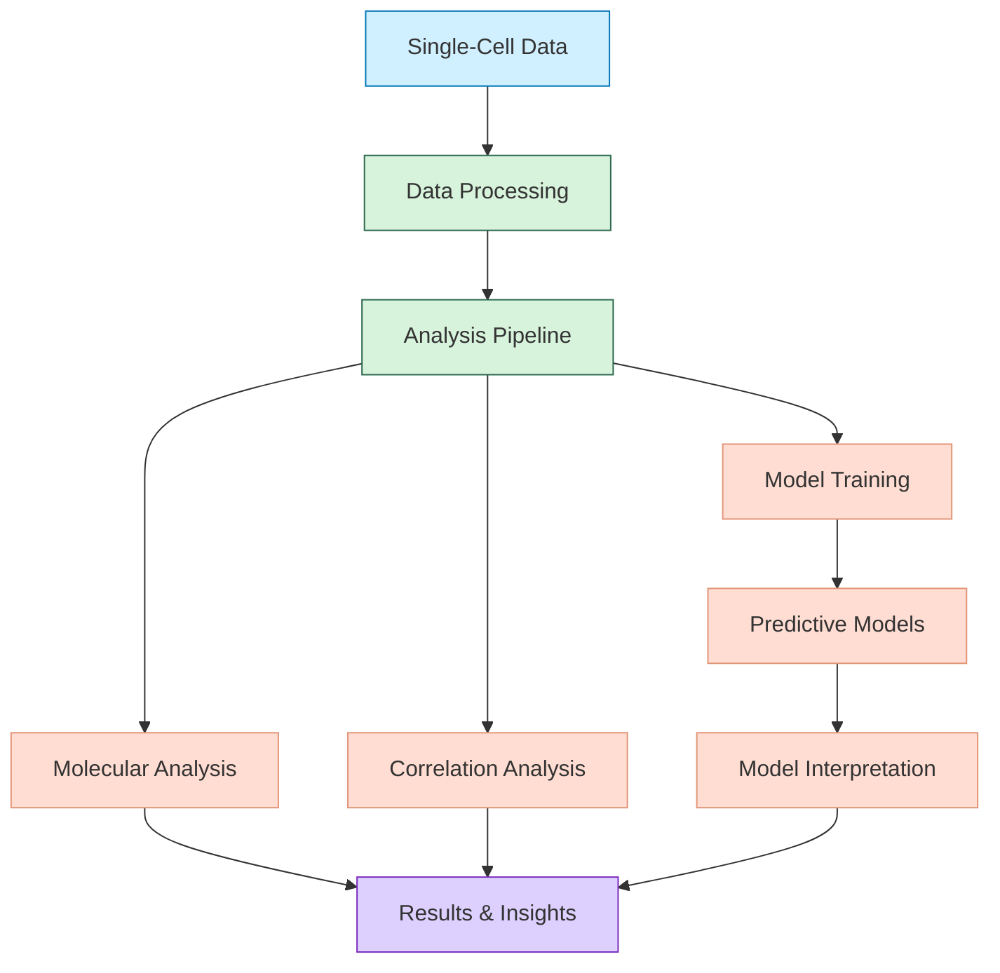
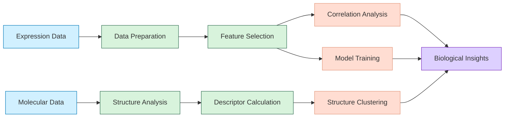

# Technical Architecture

## System Overview

The system architecture is illustrated in the following diagram:



The system is structured as a modular pipeline for analyzing single-cell perturbation data, focusing on correlations between genetic expression, drug responses, and molecular properties.

## Data Flow Architecture

The following diagram illustrates how data flows through our system:

```mermaid
flowchart LR
    subgraph Input
        A1[Expression Data]
        A2[Molecular Structures]
    end

    subgraph Processing
        B1[Data Preprocessing]
    end

    subgraph Analysis
        C1[Molecular Analysis]
        C2[Correlation Analysis]
        C3[Model Training]
    end

    subgraph Output
        D1[Visualizations]
        D2[Predictive Models]
        D3[Insights]
    end

    Input --> Processing
    Processing --> Analysis
    Analysis --> Output
    
    style A1 fill:#d1f0ff,stroke:#0077b6
    style A2 fill:#d1f0ff,stroke:#0077b6
    style B1 fill:#d8f3dc,stroke:#2d6a4f
    style C1 fill:#ffddd2,stroke:#e29578
    style C2 fill:#ffddd2,stroke:#e29578
    style C3 fill:#ffddd2,stroke:#e29578
    style D1 fill:#ddd0ff,stroke:#7b2cbf
    style D2 fill:#ddd0ff,stroke:#7b2cbf
    style D3 fill:#ddd0ff,stroke:#7b2cbf
```



Our data flow is designed to handle large datasets efficiently, with clean separation between data loading, processing, analysis, and visualization.

## Analysis Pipeline

The complete workflow of our analysis pipeline is shown here:



This pipeline coordinates the various analysis components to transform raw input data into actionable biological insights.

## Component Details

### Data Processing
- Handles parsing, cleaning, and normalization of single-cell expression data
- Processes molecular structure data from SMILES strings
- Performs feature selection and dimensionality reduction

### Analysis Pipeline
- Orchestrates the end-to-end analysis workflow
- Manages dependencies between analysis components
- Provides configuration options for customizing analysis

### Visualization System
- Generates correlation heatmaps
- Creates molecular property visualizations
- Produces performance metrics visualizations
- Renders feature importance plots

### Predictive Models
- Implements cell type classification models
- Builds drug response prediction systems
- Provides functionality for model serialization and loading

### Molecular Analysis
- Calculates molecular descriptors from structures
- Performs clustering of molecular compounds
- Analyzes structure-activity relationships

## File Structure

```
/
├── src/                       # Source code
│   ├── molecular_analysis.py  # Molecular descriptor calculation and analysis
│   ├── correlation_analysis.py # Correlation analysis between features
│   ├── model_interpreter.py   # Model interpretation and visualization
│   └── test_*.py              # Test scripts for each component
├── models/                    # Saved model files
├── plots/                     # Generated visualizations
├── results/                   # Analysis results
└── docs/                      # Documentation
    ├── images/                # Architecture and workflow diagrams
    ├── architecture/          # Technical documentation
    └── tutorials/             # Usage tutorials
```

## Core Technologies

- **Python**: Primary implementation language
- **Pandas/NumPy**: Data processing
- **RDKit**: Molecular structure analysis
- **Scikit-learn/XGBoost**: Machine learning models
- **Matplotlib/Seaborn**: Visualization

## Data Formats

- **Input**: Parquet for expression data, CSV for metadata, SMILES for molecular structures
- **Intermediate**: Pandas DataFrames
- **Output**: CSV for analysis results, PNG/SVG for visualizations, Pickle for model serialization

## Development Tools

- **Git**: Version control
- **Jupyter Notebooks**: Exploratory analysis
- **Python Type Hints**: Code documentation
- **Docstrings**: Function and class documentation 