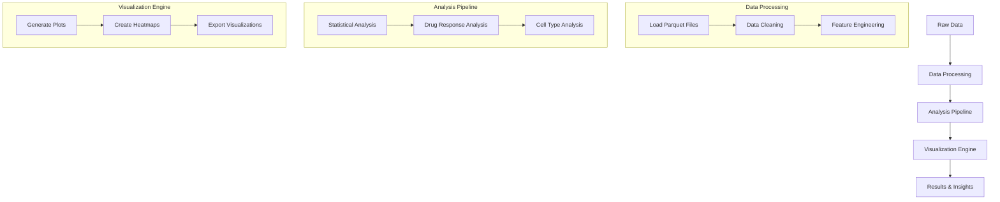

# Technical Architecture

## System Overview


```mermaid
graph TD
    A[Raw Data] --> B[Data Processing]
    B --> C[Analysis Pipeline]
    C --> D[Visualization Engine]
    D --> E[Results & Insights]

    subgraph Data Processing
        B1[Load Parquet Files] --> B2[Data Cleaning]
        B2 --> B3[Feature Engineering]
    end

    subgraph Analysis Pipeline
        C1[Statistical Analysis] --> C2[Drug Response Analysis]
        C2 --> C3[Cell Type Analysis]
    end

    subgraph Visualization Engine
        D1[Generate Plots] --> D2[Create Heatmaps]
        D2 --> D3[Export Visualizations]
    end
```

## Data Flow Architecture

```
┌─────────────────┐     ┌─────────────────┐     ┌─────────────────┐
│   Input Data    │     │   Processing    │     │    Analysis     │
│  ───────────    │     │   ───────────   │     │   ───────────   │
│ - Parquet Files │ ──► │ - Data Cleaning │ ──► │ - Statistics    │
│ - Metadata      │     │ - Normalization │     │ - Drug Effects  │
└─────────────────┘     └─────────────────┘     └─────────────────┘
                                                         │
                                                         ▼
┌─────────────────┐     ┌─────────────────┐     ┌─────────────────┐
│    Outputs      │     │  Visualization  │     │    Analysis     │
│   ───────────   │ ◄── │   ───────────   │ ◄── │   Results      │
│ - Plots         │     │ - Matplotlib    │     │ - Insights      │
│ - Reports       │     │ - Seaborn       │     │ - Patterns      │
└─────────────────┘     └─────────────────┘     └─────────────────┘
```

## Component Details

### 1. Data Processing Module
- **Input Handler**: Manages parquet file loading
- **Data Cleaner**: Removes artifacts and normalizes data
- **Feature Engineer**: Creates derived features

### 2. Analysis Pipeline
- **Statistical Engine**: Computes key metrics
- **Drug Response Analyzer**: Evaluates perturbation effects
- **Cell Type Analyzer**: Analyzes cell-specific responses

### 3. Visualization System
- **Plot Generator**: Creates standard visualizations
- **Heatmap Engine**: Generates expression heatmaps
- **Export Module**: Saves high-quality figures

## File Structure
```
project/
├── dataset/
│   ├── de_train_split.parquet
│   └── de_test_split.parquet
├── src/
│   ├── analyze_data.py
│   └── visualize_data.py
├── notebooks/
│   ├── dataset.ipynb
│   └── exploration.ipynb
└── plots/
    ├── gene_expression_heatmap.png
    └── drug_response_plots.png
```

## Technology Stack

### Core Technologies
- **Python**: Primary programming language
- **Pandas**: Data manipulation
- **NumPy**: Numerical computations
- **Matplotlib/Seaborn**: Visualization

### Data Formats
- **Parquet**: Primary data storage
- **CSV**: Data export format
- **PNG**: Visualization output

### Development Tools
- **Jupyter**: Interactive analysis
- **Git**: Version control
- **GitHub**: Code repository 