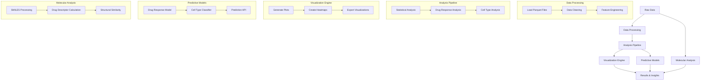

# Technical Architecture

## System Overview


```mermaid
graph TD
    A[Raw Data] --> B[Data Processing]
    B --> C[Analysis Pipeline]
    C --> D[Visualization Engine]
    D --> E[Results & Insights]
    C --> F[Predictive Models]
    F --> E
    A --> G[Molecular Analysis]
    G --> E

    subgraph Data Processing
        B1[Load Parquet Files] --> B2[Data Cleaning]
        B2 --> B3[Feature Engineering]
    end

    subgraph Analysis Pipeline
        C1[Statistical Analysis] --> C2[Drug Response Analysis]
        C2 --> C3[Cell Type Analysis]
    end

    subgraph Visualization Engine
        D1[Generate Plots] --> D2[Create Heatmaps]
        D2 --> D3[Export Visualizations]
    end
    
    subgraph Predictive Models
        F1[Drug Response Model] --> F2[Cell Type Classifier]
        F2 --> F3[Prediction API]
    end
    
    subgraph Molecular Analysis
        G1[SMILES Processing] --> G2[Drug Descriptor Calculation]
        G2 --> G3[Structural Similarity]
    end
```

## Data Flow Architecture

```
┌─────────────────┐     ┌─────────────────┐     ┌─────────────────┐
│   Input Data    │     │   Processing    │     │    Analysis     │
│  ───────────    │     │   ───────────   │     │   ───────────   │
│ - Parquet Files │ ──► │ - Data Cleaning │ ──► │ - Statistics    │
│ - Metadata      │     │ - Normalization │     │ - Drug Effects  │
└─────────────────┘     └─────────────────┘     └─────────────────┘
       │                                                 │
       ▼                                                 ▼
┌─────────────────┐                        ┌─────────────────┐ 
│  Molecular      │                        │   Predictive    │ 
│  Analysis       │                        │   Models        │ 
└─────────────────┘                        └─────────────────┘ 
       │                                                 │
       └─────────────────────┬──────────────────────────┘
                             │
                             ▼
┌─────────────────┐     ┌─────────────────┐     ┌─────────────────┐
│    Outputs      │     │  Visualization  │     │    Analysis     │
│   ───────────   │ ◄── │   ───────────   │ ◄── │   Results      │
│ - Plots         │     │ - Matplotlib    │     │ - Insights      │
│ - Reports       │     │ - Seaborn       │     │ - Patterns      │
│ - Predictions   │     │ - Drug Profiles │     │ - Predictions   │
└─────────────────┘     └─────────────────┘     └─────────────────┘
```

## Component Details

### 1. Data Processing Module
- **Input Handler**: Manages parquet file loading
- **Data Cleaner**: Removes artifacts and normalizes data
- **Feature Engineer**: Creates derived features

### 2. Analysis Pipeline
- **Statistical Engine**: Computes key metrics
- **Drug Response Analyzer**: Evaluates perturbation effects
- **Cell Type Analyzer**: Analyzes cell-specific responses

### 3. Visualization System
- **Plot Generator**: Creates standard visualizations
- **Heatmap Engine**: Generates expression heatmaps
- **Export Module**: Saves high-quality figures

### 4. Predictive Models (New)
- **Drug Response Predictor**: Predicts gene expression changes in response to drugs
- **Cell Type Classifier**: Identifies cell types from gene expression data
- **Model Evaluation**: Assesses model performance and provides insights

### 5. Molecular Analysis (New)
- **SMILES Processor**: Analyzes drug chemical structures
- **Molecular Descriptor Calculator**: Computes physicochemical properties
- **Structural Clustering**: Groups drugs by similarity

## File Structure
```
project/
├── dataset/
│   ├── de_train_split.parquet
│   └── de_test_split.parquet
├── docs/
│   ├── architecture/
│   ├── tutorials/
│   └── images/
├── models/
│   ├── cell_type_classifier.pkl
│   └── drug_response_model.pkl
├── plots/
│   └── various visualization files
├── analyze_data.py
├── drug_response_model.py (New)
├── molecular_analysis.py (New)
├── predict.py (New)
├── train_model.py (New)
├── visualize_data.py
├── dataset.ipynb
├── exploration_notebook.ipynb (New)
└── requirements.txt (New)
```

## Technology Stack

### Core Technologies
- **Python**: Primary programming language
- **Pandas**: Data manipulation
- **NumPy**: Numerical computations
- **Matplotlib/Seaborn**: Visualization
- **Scikit-learn**: Machine learning models
- **RDKit**: Molecular analysis and cheminformatics

### Data Formats
- **Parquet**: Primary data storage
- **CSV**: Data export format
- **PNG**: Visualization output
- **PKL**: Serialized model storage

### Development Tools
- **Jupyter**: Interactive analysis
- **Git**: Version control
- **GitHub**: Code repository 