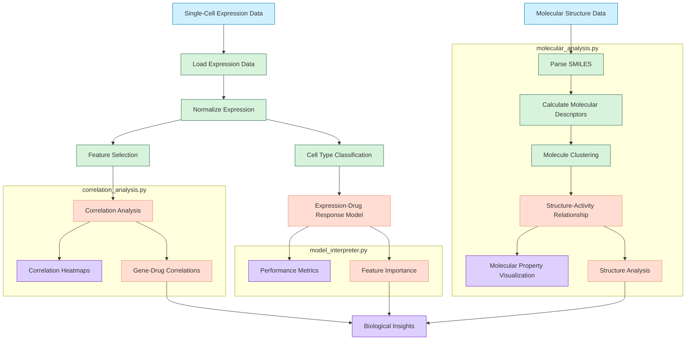

# Analysis Pipeline Diagram

This diagram illustrates the complete analysis workflow implemented in our system:

The analysis pipeline diagram shows the key computational steps in our analysis workflow, from data input through processing stages to final insights. Each color-coded section corresponds to a specific process type, and module boundaries indicate which Python file implements each component. 