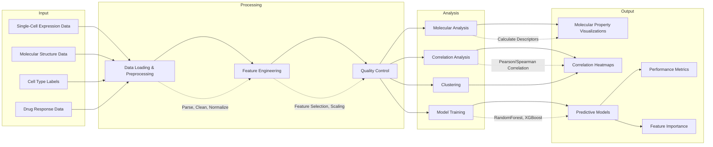

# Data Flow Diagram

This diagram illustrates how data flows through the single-cell perturbation analysis system:

The data flow diagram above shows how information is processed from raw input data through various processing and analysis stages, ultimately resulting in visualizations, models, and insights. 