# System Architecture Diagram

The following diagram illustrates the core components of the single-cell perturbation analysis system:

```mermaid
graph TD
    A[Single-Cell Data] --> B[Data Processing]
    B --> C[Analysis Pipeline]
    C --> D1[Molecular Analysis]
    C --> D2[Correlation Analysis]
    C --> D3[Model Training]
    D1 --> E[Results & Insights]
    D2 --> E
    D3 --> F[Predictive Models]
    F --> G[Model Interpretation]
    G --> E

    subgraph Data Processing
        B1[Load Parquet Files] --> B2[Data Cleaning]
        B2 --> B3[Feature Selection]
    end

    subgraph Analysis Pipeline
        C1[run_analysis.py] --> C2[Exploratory Analysis]
        C2 --> C3[Visualization]
    end

    subgraph Molecular Analysis
        D1A[molecular_analysis.py] --> D1B[Structure Analysis]
        D1B --> D1C[Descriptor Calculation]
        D1C --> D1D[Clustering & Visualization]
    end
    
    subgraph Correlation Analysis
        D2A[correlation_analysis.py] --> D2B[Property-Gene Correlation]
        D2B --> D2C[Correlation Heatmaps]
        D2C --> D2D[Property Clustering]
    end
    
    subgraph Model Training
        D3A[train_model.py] --> D3B[Cell Type Classification]
        D3B --> D3C[Drug Response Prediction]
    end
    
    subgraph Predictive Models
        F1[Cell Type Classifier] --> F2[Drug Response Predictor]
        F2 --> F3[predict.py]
    end
    
    subgraph Model Interpretation
        G1[model_interpreter.py] --> G2[Performance Metrics]
        G2 --> G3[Feature Importance]
        G3 --> G4[Prediction Visualization]
    end
```

This architecture diagram shows the key components of our single-cell perturbation analysis system, highlighting the relationships between different modules and the data flow across the system. 